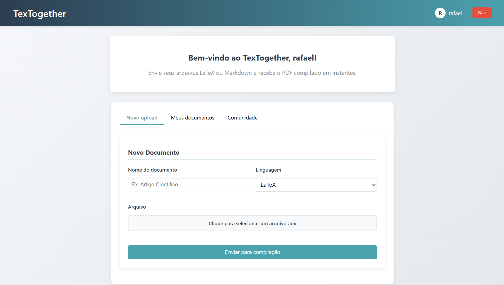

# Projeto: TeXTogether

Acesso: [http://web-t3.rodrigoappelt.com:8080](http://web-t3.rodrigoappelt.com:8080)

## Desenvolvedores

Rafael Carneiro Pregardier e Rodrigo Appelt

## Nosso produto

O nosso produto é uma plataforma integradora com o objetivo de compartilhar conhecimento entre vários usuários de forma fácil. A partir de uma entrada em LaTeX ou Markdown, o servidor automaticamente compila o código para PDF e 
compartilha na rede para todos os outros usuários verem.

> **Nota:** o uso de arquivos mardown (.md) está suspenso atualmente devido a um bug no serviço de compilação. Como não há tempo para a troca de contexto e recriação das imagens no docker, essa funcionalidade foi cortada _temporariamente_.

## Desenvolvimento

O desenvolvimento foi feito em duas frentes separadas, com o backend corrindo erros que o frontend apontava e o frontend se adaptando conforme a arquitetura do backend. Dessa forma foi atingido um 
tempo rápido de iteração e desenvolvimento. 

Para o backend, foi escolhido ASP.NET com o SDK do .NET 8 para diferenciar dos últimos trabalhos feitos na disciplina. O banco de dados foi utilizado um
parecido com o SQLite, o LiteDB. O LiteDB é um banco de dados **NoSQL** escrito em 100% código _managed_ e adaptado para o uso fluente em C#. O deploy do backend foi feito em um servidor privado
rodando Linux OpenSUSE Leap e utilizando **Docker** para as imagens dos serviços (tanto o backend como a dependência que compila arquivos .tex) e Cloudflare DNS para o registro dos nomes, tanto para
o frontend e o backend.

Para o frontend, foi escolhido as mesmas tecnologias do segundo projeto, elas sendo o React, a partir do Create React App, Node.Js para rodar o servidor localmente, Html para a construção dos componentes
e css puro para a estilização. O deploy do frontend foi feito na Vercel, também seguindo na linha do segundo projeto.

## Tecnologias

* Frontend
  * Create React App
  * Node.js
  * Vercel
  * React
  * Html
  * Css
* Backend
  * ASP.NET + .NET 8
  * Docker Compose
  * TeXLive (imagem `latest` do DockerHub)
  * LiteDB

## Ambiente de Desenvolvimento

* Frontend
  * Visual Studio Code e extensões 
  * NPM
* Backend
  * Visual Studio 2022
  * Postman
  * Deploy
    * OpenSUSE Leap 15.6
    * Docker 27.5.1
  
## Referências e Créditos

* Github Copilot
* ChatGPT: dúvidas sobre docker compose e asp.net

---

Projeto entregue para a disciplina de Desenvolvimento de Software para a Web em 2025a
